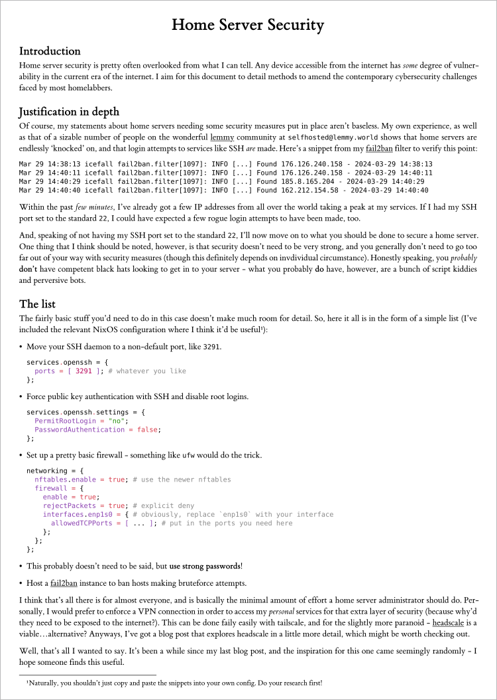

# Warehouse
This is, as the repository's name suggests, a warehouse for all of my public documents. They're all written with Typst, and some of them might be found elsewhere, like [my blog](https://devraza.github.io).

Here's an image of how these documents look after being compiled with `typst`:

